# datalab 报告

姓名：李悦溪

学号：2025200704

| 项目 | 得分 |
| --- | ---: |
| 总分 | 37/37 |
| bitAnd | 1/1 |
| bitXor | 1/1 |
| samesign | 2/2 |
| logtwo | 4/4 |
| byteSwap | 4/4 |
| reverse | 3/3 |
| logicalShift | 3/3 |
| leftBitCount | 4/4 |
| float_i2f | 4/4 |
| floatScale2 | 4/4 |
| float64_f2i | 3/3 |
| floatPower2 | 4/4 |

## 测试结果

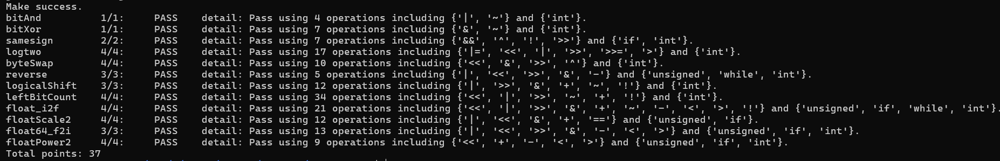

## 解题报告

### 亮点

1. `byteSwap`：利用异或的自消性完成字节交换。
2. `leftBitCount`：用 `16、8、4、2、1` 的二分思路统计连续位。
3. `float_i2f`：完整处理了符号、规格化和向偶数舍入。

### 1. bitAnd

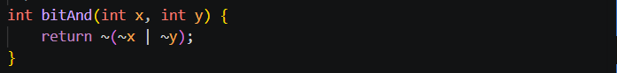

这里直接使用德摩根定律。`~(x & y)` 等价于 `~x | ~y`，因此对等式两边再取反，就得到 `x & y = ~(~x | ~y)`。这样只用取反和按位或就实现了按位与。

### 2. bitXor

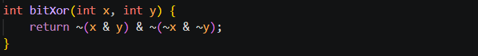

异或只在两个对应位不同时为 `1`。换个角度看，就是既不能同时为 `1`，也不能同时为 `0`。`~(x & y)` 排除了同时为 `1` 的位置，`~(~x & ~y)` 排除了同时为 `0` 的位置，把这两个结果按位与，剩下的就是两个位不同的位置。

### 3. samesign

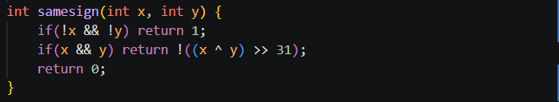

这题主要需要单独考虑 `0`，因为题目规定 `0` 既不是正数，也不是负数。

- `x` 和 `y` 都是 `0` 时，返回 `1`。
- 两者都非零时，对它们进行异或。如果符号相同，异或结果的符号位为 `0`，右移 31 位后再取反得到 `1`；如果符号不同，则得到 `0`。
- 只有一个数为 `0` 时，返回 `0`。

### 4. logtwo

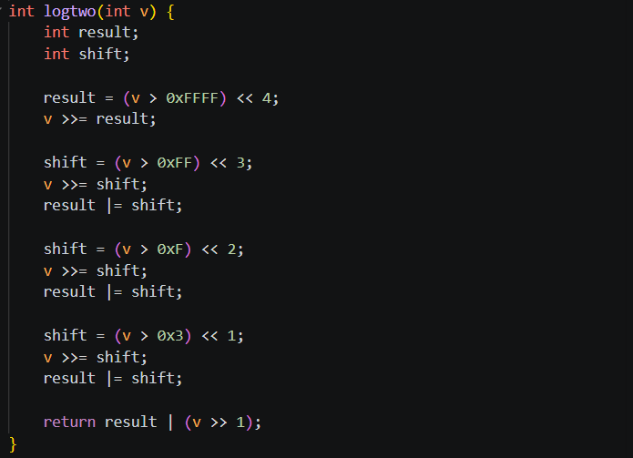

一个正数以 2 为底的整数对数，其实就是最高位 `1` 的位置。我的做法不是一位一位地找，而是按 `16、8、4、2、1` 位逐步缩小范围。

先看 `v` 是否大于 `0xFFFF`，如果是，说明答案至少为 16，就把 `v` 右移 16 位；接下来再分别用 `0xFF`、`0xF` 和 `0x3` 判断是否还需要加上 `8、4、2`。最后剩下的情况通过 `v >> 1` 判断是否再加 `1`。这个过程相当于对最高位的位置做二分查找。

### 5. byteSwap

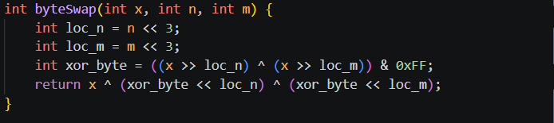

先将字节编号 `n` 和 `m` 乘以 8，得到两个字节对应的位偏移量。然后把这两个字节移动到最低位，异或后再用 `0xFF` 保留最低 8 位，得到它们之间的差异。

假设两个字节分别是 `a` 和 `b`，差异就是 `a ^ b`。由于 `a ^ (a ^ b) = b`，`b ^ (a ^ b) = a`，所以把这个差异分别移回两个字节的位置，再与原数异或，就能完成交换，其他字节不会受到影响。

### 6. reverse

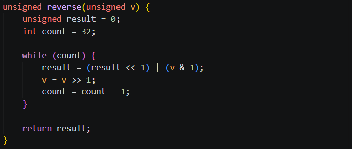

我用一个循环依次处理 `v` 的 32 个二进制位。每轮先把 `result` 左移一位，然后用 `v & 1` 取出 `v` 当前的最低位，把它接到 `result` 的末尾；之后再将 `v` 右移一位，继续处理下一位。

由于读取顺序是从原数的最低位到最高位，而写入时每次都把已有结果左移，所以循环结束后，所有位的顺序正好反转。这里使用 `unsigned`，可以保证右移时左侧补 `0`。

### 7. logicalShift

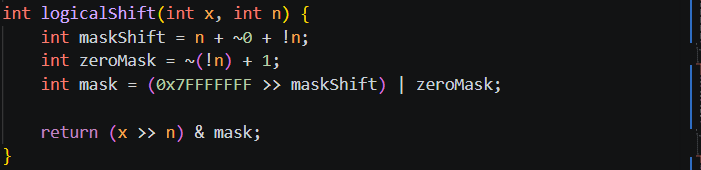

直接对负的 `int` 右移时，左侧通常会补 `1`，所以我的做法是先正常右移，再用掩码把高位多出来的 `1` 清掉。

当 `n > 0` 时，`0x7FFFFFFF >> (n - 1)` 可以得到一个低 `32-n` 位为 `1`、高 `n` 位为 `0` 的掩码。将它与 `x >> n` 按位与，就得到了逻辑右移的结果。`n = 0` 需要单独兼容，否则会出现右移负数位的情况。代码利用 `!n` 在此时构造全为 `1` 的掩码，使返回值仍然是原来的 `x`。

### 8. leftBitCount

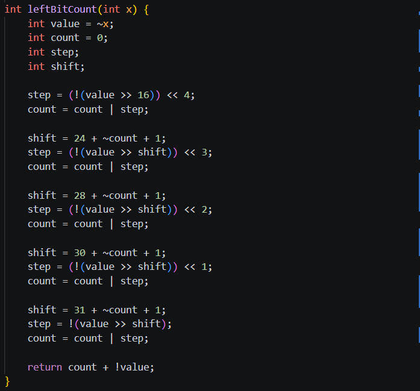

直接统计开头连续的 `1` 不太方便，所以我先对 `x` 取反。这样问题就变成了统计 `~x` 开头连续的 `0`。

接下来使用二分的思路，依次检查最高的 `16、8、4、2、1` 位是否全为 `0`。每确定一段，就把对应长度记录到 `count` 中，后续检查的位置再根据当前的 `count` 调整。如果 `x` 的 32 位全部为 `1`，那么取反后的值为 `0`，前面的检查只能累计到 31，因此最后使用 `!value` 再补上 1，得到正确结果 32。

### 9. float_i2f

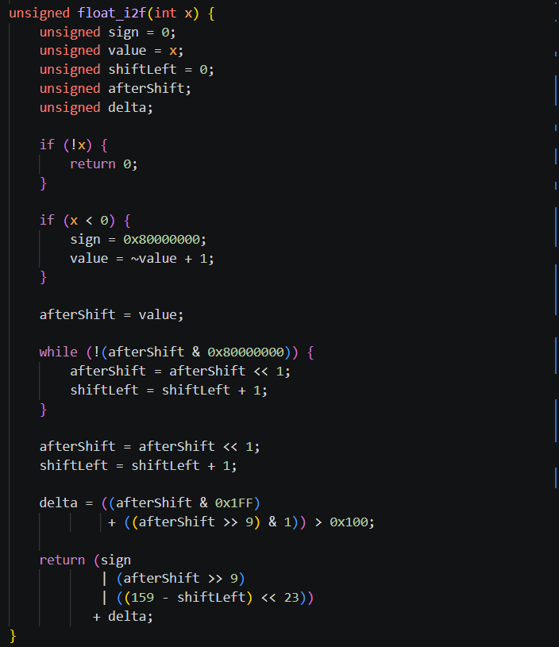

这题的重点是把整数拆成浮点数需要的符号、指数和小数三部分。

- `x = 0` 时直接返回 0。
- `x < 0` 时先记录符号位，再用补码运算得到它的绝对值。
- 将绝对值不断左移，直到最高位的 `1` 移到第 31 位。左移次数可以用来计算浮点数的指数。
- 再左移一位去掉隐藏的前导 `1`，然后取高 23 位作为小数部分。
- 被丢掉的低 9 位用于舍入：超过一半就进位；正好等于一半时，根据保留部分的最低位决定是否进位，从而满足“舍入到偶数”的规则。

最后把符号、指数和小数拼在一起，再加上舍入产生的进位。

### 10. floatScale2

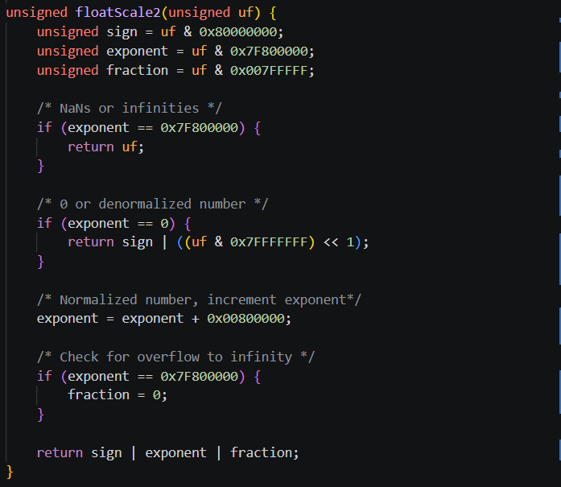

浮点数乘以 2，大多数情况下只需要让指数加 1，但特殊值需要分开处理。

- 指数全为 `1` 时，输入是 NaN 或无穷大，直接返回原值。
- 指数为 `0` 时，输入是零或非规格化数。这时保持符号位不变，将其余部分左移一位即可。如果最高的小数位进入指数区域，结果会自然变成规格化数。
- 普通规格化数只需要将指数增加 1。
- 如果增加后的指数全为 `1`，说明结果上溢，需要把小数部分清零，使结果成为无穷大。

### 11. float64_f2i

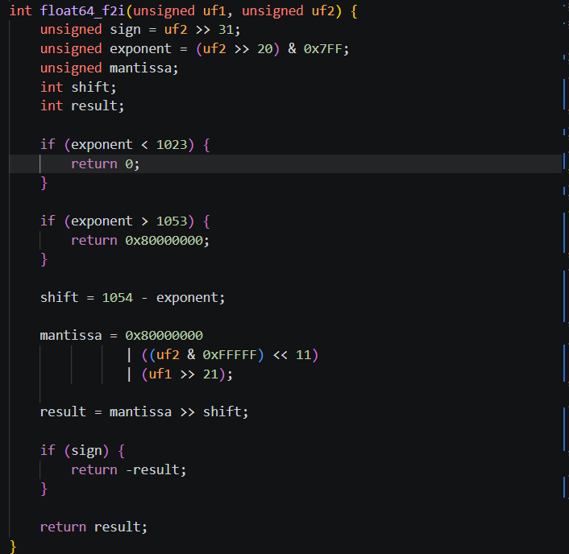

双精度浮点数被拆成了两个 32 位参数：符号位和指数位于 `uf2` 中，小数部分则由 `uf2` 的低 20 位和 `uf1` 共同组成。

先根据指数判断能否转换：

- 指数小于 `1023`，说明数值绝对值小于 1，向零取整后为 0。
- 指数大于 `1053`，说明数值超出 32 位有符号整数的范围，返回 `0x80000000`。
- 其他情况可以正常转换。

转换时先补上规格化数隐藏的前导 `1`，再接上小数部分的高位，组成一个 32 位有效数字。根据指数计算需要右移的位数，右移后小数部分会被直接丢弃，因此结果自然是向零取整。最后再根据符号位决定是否对结果取负。

### 12. floatPower2

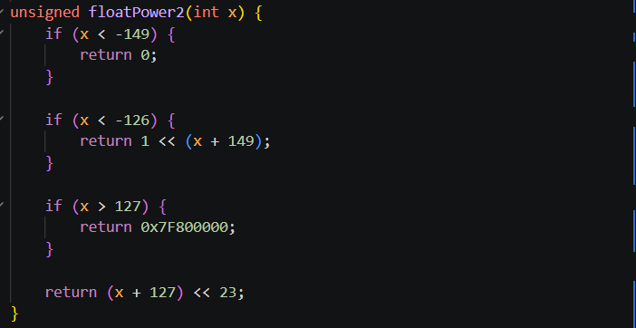

`2^x` 本身就是一个最高有效位为 `1`、其余有效位为 `0` 的数，所以只需要根据 `x` 的范围决定它属于哪种浮点数。

- `x < -149`：比最小非规格化数还小，返回 0。
- `-149 ≤ x < -126`：属于非规格化数，指数部分为 0，只需在小数部分的第 `x + 149` 位放置一个 `1`。
- `-126 ≤ x ≤ 127`：属于规格化数，小数部分为 0，将 `x + 127` 放入指数区域即可。
- `x > 127`：超过单精度浮点数的有限范围，返回正无穷大的编码。

## 反馈/收获/感悟/总结

这次实验里，我在浮点题上花的时间最多，主要难在规格化、非规格化和舍入边界的处理。写的时候不光要保证结果正确，还得考虑怎么少用几个运算符，有些地方来回调整了好几次。调试时也发现，位运算中的括号、运算符优先级和边界情况很容易出错，需要结合测试结果和报错逐步排查。

## 参考的重要资料

1. 课程讲义：`1-2-bits-bops.pdf`, `1-3-integers.pdf`, `1-4-floats.pdf`。
2. Randal E. Bryant、David R. O'Hallaron：《深入理解计算机系统（原书第 3 版）》第 2 章“信息的表示和处理”。
